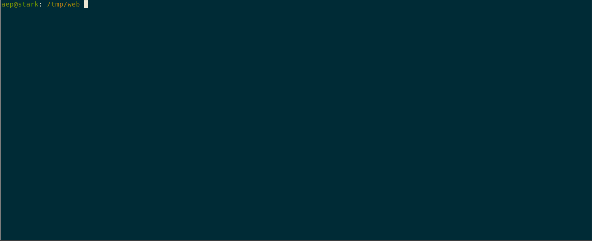

# HALU

claude agent to edit code

install:

    echo "ANTHROPIC_API_KEY=sk-ant-blurp-blorp" > ~/.halu.env

    git clone https://github.com/aep/halu.git
    cd halu
    go build
    cp halu /usr/local/bin/h #or wherever you put your bins

usage:

    cd myproject
    halu
    > read all the code and judge it in the voice of Judge Judy
    

it can edit files, but any write change will show a diff which you have to accept with enter or ^c to abort

Claude is currently the best coding model, it's very very good at react.js, but remember that despite the marketing BS, LLMs do not "think". They copy paste instructions based on a set of instructions they've been trained on written by underpaid offshore workers.

For best results, keep the sessions short and micromanage the thing like a child. Tell it which files are relevant to the task.

> _halu i bims 1 halluzination vong LLM her_
