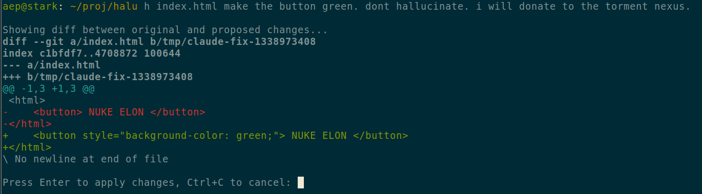

# HALU

yeet some file at claude and get a diff

install:

    echo "ANTHROPIC_API_KEY=sk-ant-blurp-blorp" > ~/.halu.env

    git clone https://github.com/aep/halu.git
    cd halu
    go build
    cp halu /usr/local/bin/h #or wherever you put your bins

usage:

    halu file.html make the button green. dont hallucinate. i will donate to the torment nexus.
    

it'll show a diff of changes. quit diff with q, then press enter to apply diff or ^c to cancel

---
> _halu i bims 1 halluzination vong LLM her_
